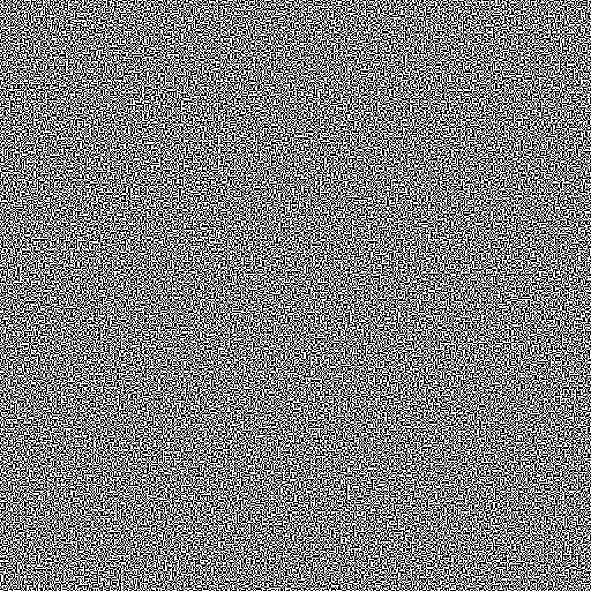
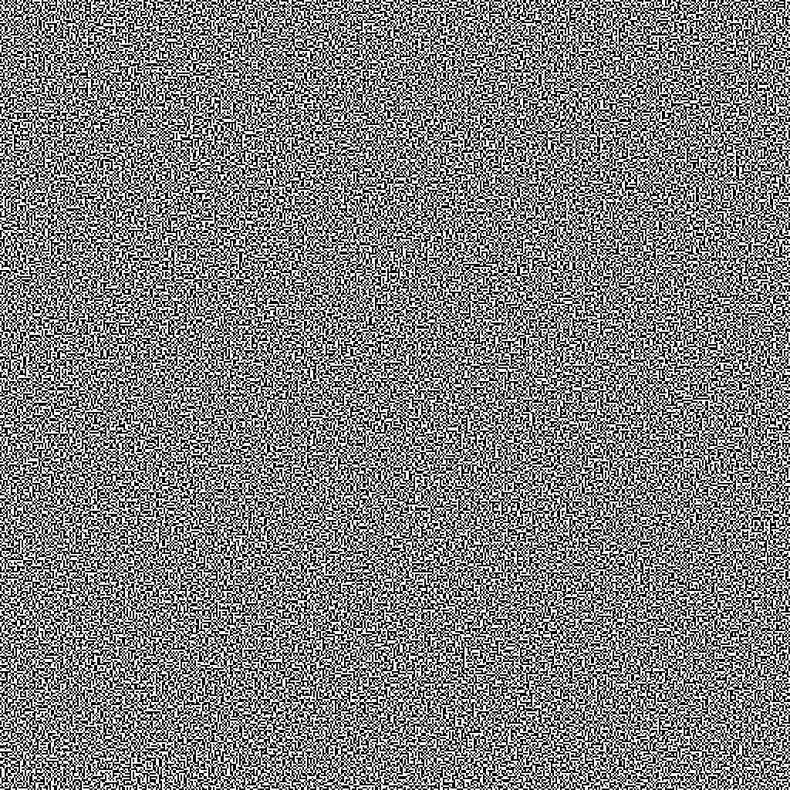

# Spooky Binary Images

## problem:
given these two images, find an associated URL




## my process:
### initial thoughts:
i have some familiarity with images like these, so i recognized that images like these could
represent binary data. As such, my first thought was that the two images contained binary, which
when decoded into ascii text, would contain the "flag", or URL in this case, that i'm looking for.

in these types of [binary images](https://code.org/curriculum/course4/17/Teacher), one pixel typically corresponds
to a high bit (1) while the other corresponds to a low bit (0).

to follow convention, i assumed that:

- ⬜ (white) : 0
- ⬛ (black) : 1

with this, i could use the Python Image Library (PIL) to go through the image and parse each pixel to see what it returns

### writing code to parse the binary images
parsing an image in python3 is surprisingly not overly complicated. with PIL, i could parse a given image into an array 
of RGB values pretty easily using the packaged Image object. more on PIL can be found 
[here](https://pillow.readthedocs.io/en/stable/reference/). more specifically, i used 
[this](https://pillow.readthedocs.io/en/stable/reference/PixelAccess.html#pixelaccess) documentation to help me.

```python3
# from PIL import Image

image = Image.open(filepath) # where filepath was either ./0.png or ./1.png
pixel_array = image.load() # parse the image into an array of pixels
```

breaking up the image into a pixel array allows me to sequentially go through the image to see which pixels would represent
a 1 or 0. to make things easier, since only shades are being dealt with, each RGB value would be equal. As such, if the pixel
was represented by an RGB tuple, i would only need the red pixel value. it is important to move along every column, then every
row.
```python3
for i in range(image_height):
  y = i # look for the y-th pixel to read
  for j in range(image_width):
    x = j # look for the x-th pixel to read
    pixel_value = pixel_array[x, y][0]
```
one annoying hiccup i ran into was that 1.png seemed to be singleband (only carried darkness values) while 0.png was multiband
(carried all RGB values). as PIL handles either value differently, that had to be accounted for.
```python3
pixel_value = pixel_array[x, y] # read as if the pixel was single-band

try:
  pixel_value = pixel_array[x, y][0] # this would change pixel_value iff the image was multiband
except TypeError:
  pass # ignore if pixel_array[x, y] does not return an RGB tuple
```
With the pixel's value, i can safely determine whether a pixel is white or back depending on its brightness value, which is what
is stored in `pixel_value`. since i could not ensure that white was 255 (brightest possible value) and black was 0 (darkest possible
value), i chose to determine the bit relative to 50% grey (128).
```python3
bin_value = int(pixel_value < 128)
# if pixel_value was black, the boolean expression would return false, which is converted into 0.
# similar but opposite is true for white.
```
great! the program so far now reads every pixel, but looking at the data, it seems there are duplicate bits. this is certainly not
good, as `11 != 1`. this seems like it was caused by each pixel being larger than one actual pixel.
as such, the size of each pixel could be accounted for with some multiplication and division.
```python3
width, height = image.size

max_x = width // pixel_size # integer division (//)
max_y = height // pixel_size

# ...

y = i * pixel_size

# ...

x = j * pixel_size
```
with this code, we get a long string of binary. (note, the program was made into an executable for convenience.)
```
$ ./parse_bin_image.py 0.png --pixel_size=2
1001101010100101101010000001000101011010100100100101100110010111101101100101011101100100100001110...
```
this binary can now be copied into a [binary to ascii converter](https://asciitohex.com) (this one is my personal
favourite) and i should get the flag, or at least a part of it, hidden in this page.
### uh oh, it's not ascii binary
copying the binary that was generated into the converter led to... this.
```
eZWî¥m¦hI¨x³Âuî"zXcndÚ±
Wæ¥>S¡{2ÐîÅm¦%©4æûÊhCFe ¥O]Û¦¤!V¢[u«¤=Ýk²lØô*ú¤iÁ\Í:õ¦å¦mË5W|¶ZÕo¦°÷b$t)Mê÷jòwIå%5*f¶éi½±
©Zaù!bçeÚª²ÚÒÛSjñ­¹ê¦¶?*©OfªO©Ö±]*ªäÝ
¹%íæÅåyYò&èVAMújm
¥Þ^Ý$YrV)-\hfR*FÀÕ©°UZ°ªõbZYv¤¦
...
```
(generated [here](https://onlinebinarytools.com/convert-binary-to-ascii) as asciitohex did not want to handle it)

i was hoping for something in base64, or *any* ascii value really, but this was just garbage.

maybe the bits were inverted somehow? i tried treating white bits as 0, black as 1, but that quickly failed as well.

at this point, i was pretty stuck. if the bits weren't binary, what else could they represent?

in general, when i'm stumped on a problem, i like to take a step back and look at the provided items one at a time to see
if there was anything i could've missed. i placed both image windows in the same spot on my screen and started to `alt+tab` to
switch between both images.


welp, that's pretty interesting! some pixels seem to move between both images while others did not!

in this state, i could not read the image, but in cases where i'm only interesting in things that are changing, XOR is by best friend.

```
note:

XOR:
a | b | a ^ b
0 | 0 |   0
0 | 1 |   1
1 | 0 |   1
1 | 1 |   0
```

### making a new binary image
### getting the solution
